<p align="center">
  
</p>

<p align="center">
  
</p>

<p align="center">
  
  
  
  
  
</p>

### `> whoami`

I build **Shopify apps** — the admin side merchants click through every day, the storefront widgets their customers see, and the quiet background jobs that keep both in sync. Mostly **TypeScript**, mostly **Remix**, always with a database that knows what it's doing.

```ts
const niko = {
  focus:   ["Shopify apps", "storefront extensions", "integrations"],
  stack:   ["TypeScript", "Remix", "React", "Prisma", "GraphQL Admin API"],
  ui:      "Polaris + Liquid",
  infra:   ["Docker", "cron & bulk-operation workers", "webhooks"],
  motto:   "ship small, ship often, keep the merchant's day boring",
};
```

### `> cat order_items.txt`

| # | Item | What's in the box |
|:-:|:-----|:------------------|
| 01 | [**eleven-staging**](https://github.com/Niko-Tymoshchuk/eleven-staging) | Custom Shopify app for a jewelry brand — Remix + Prisma admin on Polaris, a theme app extension widget, an app-proxy subscribe flow, and background workers for scheduled jobs, bulk operations and abandoned-checkout follow-ups. |
<!-- | 02 | **Shopify integration @ Lucky Orange** | (private) Uncomment this row if you want to show your work on the Lucky Orange × Shopify integration. | -->

<p align="center">
  
</p>

### `> git log --stats`

<p align="center">
  
  
</p>

<p align="center">
  
</p>

<p align="center">
  <picture>
    <source media="(prefers-color-scheme: dark)" srcset="https://raw.githubusercontent.com/Nikolay-Tymoshchuk/Nikolay-Tymoshchuk/output/snake-dark.svg" />
    
  </picture>
</p>

### `> contact --open`

<p align="center">
  <a href="https://www.linkedin.com/in/nikolay-tymoshchuk/"></a>
  <a href="https://t.me/Wonder_Wi"></a>
</p>

<p align="center">
  
  <br/>
  
</p>
